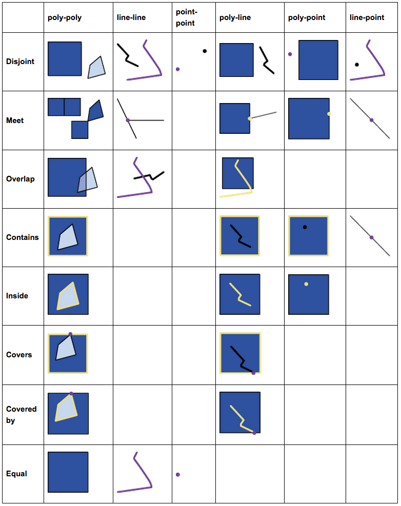

```{r setup, include=FALSE}
knitr::opts_chunk$set(echo = TRUE, warning = FALSE, message = FALSE)
```

```{r gems_logo, fig.align="center", out.width = '100%', echo = F}
knitr::include_graphics("../images/GEMS Informatics Learning.png")
```

# Geocomputation with Vector Data in R

## Instructors

Ali Joglekar, University of Minnesota ([joglekar\@umn.edu](mailto:joglekar@umn.edu))\
Yuan Chai, University of Minnesota ([chaix026\@umn.edu](mailto:chaix026@umn.edu))

------------------------------------------------------------------------

## Hands-On Material Outline

-   [Geocomputation Intro](#Geocomp)

-   [Vector Data Review](#Vector)

-   [Attribute Data Operations](#Attribute)

    -   [Exercise 1](#Ex1)

-   [Spatial Data Operations](#Spatial)

    -   [Exercise 2](#Ex2)

-   [Geometry Operations](#Geometry)

    -   [Exercise 3](#Ex3)

## Setup

### Load R Libraries

```{r libraries}
packages_to_load <- c("sf", "terra", "tmap", "spData")

for ( package in packages_to_load ) {
    # Check if package is already installed, if not, install and load the package
    if (!require(package, character.only=T, quietly=T, warn.conflicts=F)) {
        install.packages(package)
        suppressPackageStartupMessages(library(package, character.only=T, quietly=T, warn.conflicts=F))
    }
}
```

Note: For your own work, once packages are installed, it is recommended to just use `library()` to load your packages

```{r ownlib, eval=FALSE}
# Spatial data libraries
library(sf)
library(terra)
library(spData)

# Plotting libraries
library(tmap)
```

### Data

Your exercises will draw on three vector data sets from the Minnesota Geospatial Commons, which have been downloaded, cleaned, transformed and saved in the directory `../data/MN` for this workshop.

1.  [POINT] Minnesota Six-Inch Soil Temperature: <https://gisdata.mn.gov/dataset/geos-soil-temp-network>
2.  [LINES] Stream Routes - Major River Centerlines: <https://gisdata.mn.gov/dataset/water-major-river-centerlines>
3.  [POLYGONS] Groundwater Provinces of Minnesota 2021: <https://gisdata.mn.gov/dataset/geos-groundwater-provinces-mn>

### Attribution

The following material draws heavily from Robin Lovelace's Geocomputation with R textbook.

------------------------------------------------------------------------

## What is Geocomputation? {#Geocomp}

*Geocomputation* is a young term, dating back to the first conference on the subject in 1996, simply defined as the process of "applying computing technology to geographical problems" (Rees and Turton 1998)

-   Emphasis on "creative and experimental" applications" (Longley et al. 1998)
-   Using various different types of geodata and developing relevant geo-tools within the overall context of a 'scientific' approach (Openshaw and Abrahart 2000)

## Vector Data Review {#Vector}

Representation of the world using points, lines, and polygons

-   Point: a precise location in space (e.g., weather stations)

-   Line: a sequential collection of connected points (e.g., roads)

-   Polygon: a region enclosed by lines (e.g., countries)

```{r vector, fig.align="center", out.width = '50%', fig.asp=1, echo = F}
px <- c(5, 7, 8, 9, 8, 7, 6)
py <- c(7, 3, 4, 8, 9, 15, 14)
plot(px, py, type="n", axes=F, xlab = '', ylab = '')
polygon(px, py, col = "khaki1")
points(c(6, 9, 8, 8.5), c(9, 14, 8, 9), pch=20, col = "peachpuff4", lwd = 3)
lines(c(5, 6, 7, 8), c(5, 6,10, 11), col = "steelblue1",  lwd = 3)
lines(c(8, 9), c(14, 12), col = "dark green", lwd = 3)
```

Vector data in R well supported by `sf` class, which extends `data.frame`

-   `sf` objects represents points, lines and polygons as discrete entities in space

-   `sf` objects have one column per attribute variable and one row per observation, or feature

-   `sf` objects have special column that contains geometry data

-   `sf` geometry column is a list column \-- can contain multiple geographic entities per row

-   `sf` enables full power of R's data analysis capabilities to be unleashed on geographic data

### Attribute Data Operations {#Attribute}

Manipulating geographic objects based on attributes

-   `subset`

-   `aggregation`

-   `merge`

### Vector Attribute Manipulation: Subset

Base R subsetting functions include `[` and `subset()`, both of which can be used with `sf` objects

The following code chunk creates a new object containing nations whose surface area is greater than 1 million km2 and smaller than 5 million km2:

```{r world}
world
```

```{r attr_sub}
mid_countries = world[world$area_km2 > 1000000 & world$area_km2 < 5000000, ]
mid_countries
```

And then maps the two objects together using `tmap`

```{r attr_sub_map, fig.align="center", out.width = '100%', echo = F}
p_cntr1 = tm_shape(world) + tm_polygons(col = "iso_a2", legend.show = FALSE) +
  tm_layout(main.title = "All Countries", main.title.size = 1,
            bg.color = "lightblue")
p_cntr2 = tm_shape(world) + tm_polygons(col = "white", alpha = 0.75) +
  tm_shape(mid_countries) + tm_polygons(col = "iso_a2", legend.show = FALSE) +
  tm_layout(main.title = "Mid-Sized Countries", main.title.size = 1,
            bg.color = "lightblue")
tmap_arrange(p_cntr1, p_cntr2, ncol = 1)
```

### Vector Attribute Manipulation: Aggregation

Aggregation operations summarize data sets by a 'grouping variable', typically an attribute column

The following code chunk calculates the number of people per continent based on country-level data (one row per country):

```{r attr_agg}
world_agg = aggregate(world["pop"], by = list(world$continent),
                       FUN = sum, na.rm = TRUE)
```

```{r attr_agg_map, fig.align="center", out.width = '100%', echo = F}
p_pop1 = tm_shape(world) +
  tm_polygons(col = "pop", title = "Population", style = "jenks") +
  tm_layout(main.title = "Population by Country", main.title.size = 1,
            bg.color = "lightblue")
p_pop2 = tm_shape(world_agg) +
  tm_polygons(col = "pop", title = "Population", style = "jenks") +
  tm_layout(main.title = "Population by Continent", main.title.size = 1,
            bg.color = "lightblue") +
  tmap_options(check.and.fix = TRUE)
tmap_arrange(p_pop1, p_pop2, ncol = 1)
```

### Vector Attribute Manipulation: Merge

Merge, or join, operations combine data from different sources based on a shared 'key' variable

The following code chunk takes an `sf` object (`world`) as the first argument and adds columns to it from a separate `data.frame` (`coffee_data`) specified as the second argument):

```{r coffee}
head(world)
head(coffee_data)
```

```{r attr_mrg}
world_coffee = merge(world, coffee_data, by = "name_long")
world_coffee
```

```{r attr_mrg_map, fig.align="center", out.width = '100%', echo = F}
tm_shape(world) + tm_polygons(col = "white") +
  tm_shape(world_coffee) +
  tm_polygons(col = "coffee_production_2017", title = "1,000 60kg bags", style = "jenks") +
  tm_layout(main.title = "2017 Coffee Production", main.title.size = 1,
            bg.color = "lightblue")
```

In the majority of cases where variable names are not the same, you have two options:

1.  Rename key variables in one of the objects so they match

2.  Use the `by` argument to specify the joining variables

```
sf2 <- merge(sf1, dat1, by = "var") sf2 <- merge(sf1, dat1, by.x = "var1", by.y = "var2")
```

Types of merges

-   Inner join preserves matching features from both data sets

```
sf2 <- merge(sf1, dat1, by.x = "var1", by.y = "var2", all = F)
```

-   Left (outer) join preserves features from the first data set

```
sf2 <- merge(sf1, dat1, by.x = "var1", by.y = "var2", all.x = T)
```

-   Right (outer) join preserves features from the second data set

```
sf2 <- merge(sf1, dat1, by.x = "var1", by.y = "var2", all.y = T)
```

-   Outer join preserves all features from both data sets

```
sf2 <- merge(sf1, dat1, by.x = "var1", by.y = "var2", all = T)
```

### Exercise 1: Attribute Data Operations {#Ex1}

> *Data Source:*\
> Groundwater Provinces shapefile found at `../data/MN/gw_prov/gw_provinces_extra.shp`

For today's workshop, the data has been downloaded, cleaned, transformed, and saved in the directory `../data/MN`.

1.  Find and plot all groundwater provinces in Minnesota that have `var1` equal to "a" and `var3` greater than 100.

```{r ex1.1}
# Use this code block to work through the exercise
# Answers are available in separate .RMD file for Exercise 1
```

------------------------------------------------------------------------

2.  Run the following code:

```{r gw_prov_df}
gw_prov_df <- data.frame(provID = as.character(c(seq(1:5),7)),
                         var4 = sample(c("yes","no"), size = 6, replace = TRUE),
                         var5 = runif(n = 6, min = 10, max = 50))
```

Add variables from `gw_prov_df` to `gw_prov`, and create a new object called `gw_prov_stats`.
What function did you use and why?
Which variable is key in both data sets?
How many observations are in your new object?

```{r ex1.2}
# Use this code block to work through the exercise
# Answers are available in separate .RMD file for Exercise 1
```

------------------------------------------------------------------------

3.  What is the aggregate `var3` by `var1`?

```{r ex1.3}
# Use this code block to work through the exercise
# Answers are available in separate .RMD file for Exercise 1
```

------------------------------------------------------------------------

## Spatial Data Operations {#Spatial}

Modifying geographic objects based on their location and shape

-   spatial subset

-   topological relations

-   spatial joining

-   spatial data aggregation

### Vector Spatial Data Operations: Subset

Select features of a spatial object based on whether or not they in some way relate in space to another object

The following code chunk first creates an object representing Canterbury, then uses spatial subsetting to return all high points in the region:

```{r canterbury, fig.align="center", out.width = '100%'}
plot(st_geometry(nz))
canterbury = nz[nz$Name == "Canterbury",]
plot(st_geometry(canterbury))
```

```{r spatial_sub}
canterbury_height = nz_height[canterbury, ]
```

```{r spatial_sub_map, fig.align="center", out.width = '100%', echo = F}
p_hpnz1 = tm_shape(nz) + tm_polygons(col = "white") +
  tm_shape(nz_height) + tm_symbols(shape = 2, col = "red", size = 0.25) +
  tm_layout(main.title = "High points in New Zealand", main.title.size = 1,
            bg.color = "lightblue")
p_hpnz2 = tm_shape(nz) + tm_polygons(col = "white") +
  tm_shape(canterbury) + tm_fill(col = "gray") +
  tm_shape(canterbury_height) + tm_symbols(shape = 2, col = "red", size = 0.25) +
  tm_layout(main.title = "High points in Canterbury", main.title.size = 1,
            bg.color = "lightblue")
tmap_arrange(p_hpnz1, p_hpnz2, ncol = 2)
```

### Vector Spatial Data Operations: Topology

Topological relations describe the spatial relationships between objects

```{r topo, fig.align="center", out.width = '100%', echo = F}

```

Consider the following figure which contains a polygon (`a`) and some points (`p`).

```{r topo_fig, fig.align="center", out.width = '100%', echo = F}
# create a polygon
a_poly <- st_polygon(list(rbind(c(-1, -1), c(1, -1), c(1, 1), c(-1, -1))))
a <- st_sfc(a_poly)
# create points
p_matrix <- matrix(c(0.5, 1, -1, 0, 0, 1, 0.5, 1), ncol = 2)
p_multi <- st_multipoint(x = p_matrix)
p <- st_cast(st_sfc(p_multi), "POINT")

par(pty = "s")
plot(a, border = "red", col = "gray", axes = TRUE)
plot(p, add = TRUE, lab = 1:4, pch = 1)
text(p_matrix[, 1] + 0.04, p_matrix[, 2] - 0.06, 1:4, cex = 1.3)
```

Which of the points in `p` **intersect** in some way with polygon `a`?

```{r intersect}
sel <- st_intersects(p, a, sparse = F)
sel[,1]
```

```{r intersect_fig, fig.align="center", out.width = '100%', echo = F}
par(pty = "s")
plot(a, border = "red", col = "gray", axes = TRUE)
plot(p[-sel[,1]], add = TRUE, lab = 1:4, pch = 1)
plot(p[sel[,1]], add = TRUE, pch = 16, col = "blue", bg = "blue", cex = 1.3)
text(p_matrix[, 1] + 0.04, p_matrix[, 2] - 0.06, 1:4, cex = 1.3)
```

Which of the points in `p` are **disjointed** from polygon `a`?

```{r disjoint}
sel <- st_disjoint(p, a, sparse = F)
sel[,1]
```

```{r disjoint_fig, fig.align="center", out.width = '100%', echo = F}
par(pty = "s")
plot(a, border = "red", col = "gray", axes = TRUE)
plot(p[-sel[,1]], add = TRUE, lab = 1:4, pch = 1)
plot(p[sel[,1]], add = TRUE, pch = 16, col = "blue", bg = "blue", cex = 1.3)
text(p_matrix[, 1] + 0.04, p_matrix[, 2] - 0.06, 1:4, cex = 1.3)
```

Which of the points in `p` are completely **within** polygon `a`?

```{r within}
sel <- st_within(p, a, sparse = F)
sel[,1]
```

```{r within_fig, fig.align="center", out.width = '100%', echo = F}
par(pty = "s")
plot(a, border = "red", col = "gray", axes = TRUE)
plot(p[-sel[,1]], add = TRUE, lab = 1:4, pch = 1)
plot(p[sel[,1]], add = TRUE, pch = 16, col = "blue", bg = "blue", cex = 1.3)
text(p_matrix[, 1] + 0.04, p_matrix[, 2] - 0.06, 1:4, cex = 1.3)
```

Which of the points in `p` **touch** (the border of) polygon `a`?

```{r touch}
sel <- st_touches(p, a, sparse = F)
sel[,1]
```

```{r touch_fig, fig.align="center", out.width = '100%', echo = F}
par(pty = "s")
plot(a, border = "red", col = "gray", axes = TRUE)
plot(p[-sel[,1]], add = TRUE, lab = 1:4, pch = 1)
plot(p[sel[,1]], add = TRUE, pch = 16, col = "blue", bg = "blue", cex = 1.3)
text(p_matrix[, 1] + 0.04, p_matrix[, 2] - 0.06, 1:4, cex = 1.3)
```

Which of the points in `p` **almost touch** (the border of) polygon `a`?

```{r alm_touch}
sel = st_is_within_distance(p, a, dist = 0.9, sparse = F)
sel[,1]
```

```{r alm_touch_fig, fig.align="center", out.width = '100%', echo = F}
par(pty = "s")
plot(a, border = "red", col = "gray", axes = TRUE)
plot(p[sel[,1]], add = TRUE, lab = 1:4, pch = 1)
plot(p[sel[,1]], add = TRUE, pch = 16, col = "blue", bg = "blue", cex = 1.3)
text(p_matrix[, 1] + 0.04, p_matrix[, 2] - 0.06, 1:4, cex = 1.3)
```

### Vector Spatial Data Operations: Spatial Join

Spatial data joining relies on shared areas of geographic space (*spatial overlay*).
Joining adds a new column to the target object (`x`), from a source object (`y`).

The following code chunk determines which countries a set of random points are in:

1.  Create set of random points within global bounding box

```{r random}
set.seed(2018) # set seed for reproducibility
bb_world = st_bbox(world) # the world's bounds
random_df = data.frame(
  x = runif(n = 10, min = bb_world[1], max = bb_world[3]),
  y = runif(n = 10, min = bb_world[2], max = bb_world[4])
)
random_points <- st_as_sf(random_df, coords = c("x","y")) # convert to sf object
st_crs(random_points) <- 4326  # set geographic CRS

random_points
```

2.  Extract countries that intersect with random points (for visualization)

```{r world_random}
world_random = world[random_points, ]
world_random
```

3.  Join random points and country name attribute from `world`

```{r spatial_join}
random_joined = st_join(random_points, world["name_long"])
random_joined$name_long = as.character(random_joined$name_long)

random_joined
```

```{r spatial_join_map, fig.align="center", out.width = '100%', echo = F}
jm0 = tm_shape(world) + tm_borders(lwd = 0.2) + tm_format("World")

jm1 = jm0 +
  tm_shape(shp = random_points, bbox = bb_world) +
  tm_symbols(col = "black", shape = 4, border.lwd = 2) +
  tm_layout(scale = 1, legend.bg.color = "white", legend.bg.alpha = 0.3, legend.position = c("right", "bottom"))

jm2 = jm0 +
  tm_shape(world_random, bbox = bb_world) +
  tm_fill(col = "name_long", palette = "Dark2") +
  tm_layout(legend.show = FALSE)

jm3 = jm0 +
  tm_shape(shp = random_joined, bbox = bb_world) +
  tm_symbols(col = "name_long", shape = 4, border.lwd = 2, palette = "Dark2") +
  tm_layout(legend.show = FALSE)

jm4 = jm0 +
  tm_shape(shp = random_joined, bbox = bb_world) +
  tm_symbols(col = "name_long", shape = 4, border.lwd = 2, palette = "Dark2") +
  tm_layout(legend.only = TRUE)

tmap_arrange(jm1, jm2, jm3, jm4, nrow = 2)
```

### Vector Spatial Data Operations: Spatial Aggregation

Similar to aggregation by attribute, but instead use the geometry of the source to define how values in the target object are grouped

The following code chunk calculates the average height of high points in each New Zealand region:

```{r spatial_agg}
nz_avheight = aggregate(x = nz_height, by = nz, FUN = mean)
```

```{r spatial_agg_map, fig.align="center", out.width = '100%', echo = F}
p1 <- tm_shape(nz) +
  tm_polygons()

p2 <- tm_shape(nz) +
  tm_polygons(alpha = 0.2) +
  tm_shape(nz_height) +
  tm_dots(col = "elevation", size = 0.25, n = 5, alpha = 0.7)

p3 <- tm_shape(nz_avheight) +
  tm_fill("elevation", breaks = seq(27, 29, by = 0.5) * 1e2) +
  tm_borders()
tmap_arrange(p1, p2, p3)
```

**Reminder:** Spatial aggregations use two different spatial objects, while attribute aggregations use two (or more) attributes within a single spatial object.

```{r attr_agg2}
nz_popisl = aggregate(x = nz["Population"], by = list(nz$Island), FUN = sum, na.rm = TRUE)
nz_popisl
```

```{r attr_agg2_map, fig.align="center", out.width = '100%', echo = F}
p1 <- tm_shape(nz) +
  tm_polygons("Population")

p2 <- tm_shape(nz_popisl) +
  tm_polygons("Population")
tmap_arrange(p1, p2)
```

### Exercise 2: Spatial Data Operations {#Ex2}

> *Data Sources:*
>
> -   Groundwater Provinces shapefile found at `..data/MN/gw_prov/gw_provinces_extra.shp`
>
> -   Minnesota rivers shapefile found at `..data/MN/stream_routes/mn_rivers.shp`
>
> -   Soil temp stations shapefile found at `..data/MN/soil_temp/soil_temp.shp`

For today's workshop, the data has been downloaded, cleaned, transformed, and saved in the directory `../data/MN`.

1.  Find and plot all the rivers found in groundwater province 5

    ```{r ex2.1}
    # Use this code block to work through the exercise
    # Answers are available in separate .RMD file for Exercise 2
    ```

    ------------------------------------------------------------------------

2.  Which groundwater province does the Lamberton (soil sample) MDA weather station sit in?

    ```{r ex2.2}
    # Use this code block to work through the exercise
    # Answers are available in separate .RMD file for Exercise 2
    ```

    ------------------------------------------------------------------------

3.  Find all the weather stations (soil sample sites) that are within 10 km of the Mississippi river.

    ```{r ex2.3}
    # Use this code block to work through the exercise
    # Answers are available in separate .RMD file for Exercise 2
    ```

    ------------------------------------------------------------------------

## Geometry Operations {#Geometry}

Modifying geographic objects based on their geometry

-   centroids

-   buffer

-   clipping

-   geometry unions

### Vector Geometry Operations: Centroids

Centroid operations identify the center of geographic objects.

The most commonly used centroid operation is the *geographic centroid*, which represents the center of mass in a spatial object (think of balancing a plate on your finger)

The following code chunk calculates the centroid of the New Zealand regions and Seine tributaries

```{r geo_cent}
nz_centroid = st_centroid(nz)
seine_centroid = st_centroid(seine)
```

```{r geo_cent_map, fig.align="center", out.width = '100%', echo = F}
p_nz_cent = tm_shape(nz) + tm_polygons("Name") +
  tm_shape(nz_centroid) + tm_bubbles("Name", size = 0.2) +
  tm_layout(main.title = "New Zealand Region Centroids", legend.show = FALSE)
p_seine_cent = tm_shape(seine) + tm_lines("name") +
  tm_shape(seine_centroid) + tm_bubbles("name", size = 0.2) +
  tm_layout(main.title = "Seine Tributary Centroids", legend.show = FALSE)
tmap_arrange(p_nz_cent, p_seine_cent, ncol = 2)
```

### Vector Geometry Operations: Buffer

Buffers are polygons representing the area within a given distance of a geometric feature: regardless of whether the input is a point, line or polygon, the output is a polygon.

The following chunk calculates buffers around the New Zealand regions and Seine tributaries

```{r geo_buff}
nz_buff = st_buffer(nz, dist = 50000)
seine_buff = st_buffer(seine, dist = 5000)
```

```{r geo_buff_map, fig.align="center", out.width = '100%', echo = F}
p_buffs1 = tm_shape(nz_buff) + tm_polygons(col = "Name") +
  tm_shape(nz) + tm_borders() +
  tm_layout(main.title = "New Zealand Region: 50km Buffer", legend.show = FALSE)
p_buffs2 = tm_shape(seine_buff) + tm_polygons(col = "name") +
  tm_shape(seine) + tm_lines() +
  tm_layout(main.title = "Seine Tributaries: 5km Buffer", legend.show = FALSE)
tmap_arrange(p_buffs1, p_buffs2, ncol = 2)
```

### Vector Geometry Operations: Clipping

Spatial clipping involves changes to the geometry columns of at least some of the affected features

The following figure demonstrates how this works for all combinations of the 'Venn' diagram representing object `x` and object `y`.

```{r venn, fig.align="center", out.width = '100%', echo = F}
if(!exists("b")) {
  b = st_sfc(st_point(c(0, 1)), st_point(c(1, 1))) # create 2 points
  b = st_buffer(b, dist = 1) # convert points to circles
  l = c("x", "y")
  x = b[1]
  y = b[2]
  x_and_y = st_intersection(x, y)
}

old_par = par(mfrow = c(3, 3), mai = c(0.1, 0.1, 0.1, 0.1))
plot(b)
y_not_x = st_difference(y, x)
plot(y_not_x, col = "grey", add = TRUE)
text(x = 0.5, y = 1, "st_difference(y, x)")
plot(b)
plot(x, add = TRUE, col = "grey")
text(x = 0.5, y = 1, "x")
plot(b, add = TRUE)
x_or_y = st_union(x, y)
plot(x_or_y, col = "grey")
text(x = 0.5, y = 1, "st_union(x, y)")
x_and_y = st_intersection(x, y)
plot(b)
plot(x_and_y, col = "grey", add = TRUE)
text(x = 0.5, y = 1, "st_intersection(x, y)")
# x_xor_y = st_difference(x_xor_y, x_and_y) # failing
x_not_y = st_difference(x, y)
x_xor_y = st_sym_difference(x, y)
plot(x_xor_y, col = "grey")
text(x = 0.5, y = 1, "st_sym_difference(x, y)")
plot.new()
plot(b)
plot(x_not_y, col = "grey", add = TRUE)
text(x = 0.5, y = 1, "st_difference(x, y)")
plot(b)
plot(y, col = "grey", add = TRUE)
plot(b, add = TRUE)
text(x = 0.5, y = 1, "y")
par(old_par)
```

### Vector Geometry Operations: Unions

Spatial unions silently dissolve the geometries of touching polygons in the same group

Remember our aggregation of the number of people per continent based on country-level data:

```{r geo_union}
world_agg = aggregate(world["pop"], by = list(world$continent),
                       FUN = sum, na.rm = TRUE)
```

```{r geo_union_map, fig.align="center", out.width = '100%', echo = F}
p_pop1 = tm_shape(world) + tm_polygons(col = "pop", title = "Population", style = "jenks") +
  tm_layout(main.title = "Population by Country", main.title.size = 1,
            bg.color = "lightblue")
p_pop2 = tm_shape(world_agg) + tm_polygons(col = "pop", title = "Population", style = "jenks") +
  tm_layout(main.title = "Population by Continent", main.title.size = 1,
            bg.color = "lightblue")
tmap_arrange(p_pop1, p_pop2, ncol = 1)
```

### Exercise 3: Geometry Data Operations {#Ex3}

> *Data Source:*
>
> -   Groundwater Provinces shapefile found at `..data/MN/gw_prov/gw_provinces_extra.shp`
>
> -   Minnesota rivers shapefile found at `..data/MN/stream_routes/mn_rivers.shp`

For today's workshop, the data has been downloaded, cleaned, transformed, and saved in the directory `../data/MN`.

1.  Find the centroid of the Mississippi River

    ```{r ex3.1}
    # Use this code block to work through the exercise
    # Answers are available in separate .RMD file for Exercise 3
    ```

    ------------------------------------------------------------------------

2.  Create a 10km buffer around the Mississippi River

    ```{r ex3.2}
    # Use this code block to work through the exercise
    # Answers are available in separate .RMD file for Exercise 3
    ```

    ------------------------------------------------------------------------

3.  Find and plot the segments of the Mississippi river that run through groundwater province 5

    ```{r ex3.3}
    # Use this code block to work through the exercise
    # Answers are available in separate .RMD file for Exercise 3
    ```
